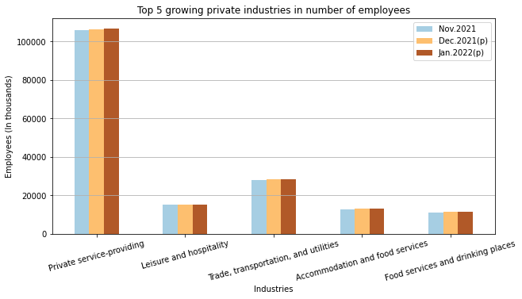
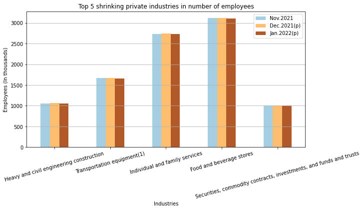
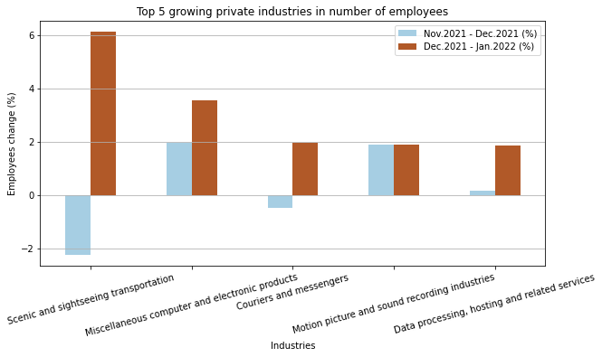
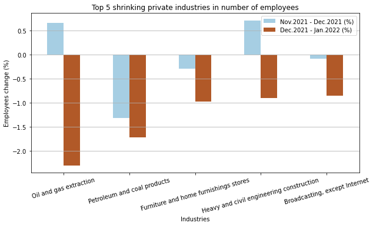
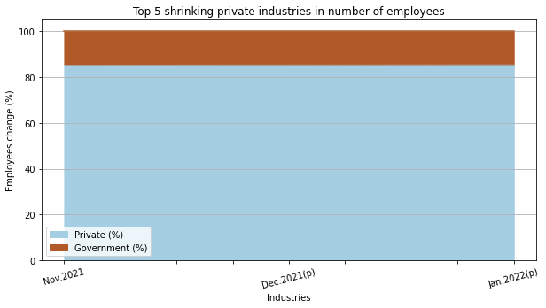
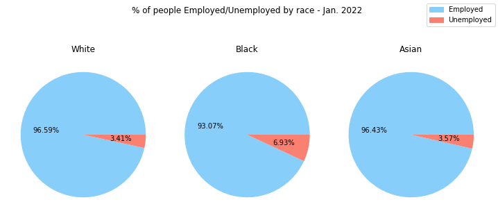
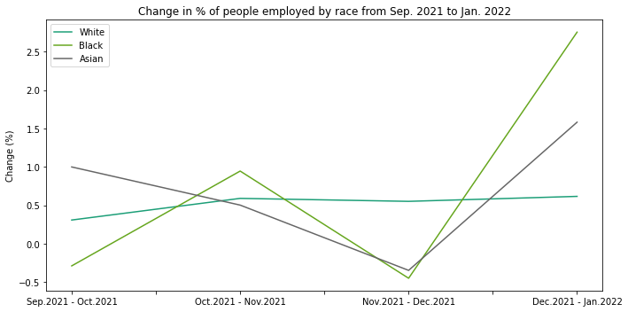

# NFP-Analysis

**Disclaimer:** I'm not an economist, nor certified investors or someone professionally qualified to put in question the data integrity or the effects of this report on the markets, the whole purpose of this project is to put in practice my data analysis studies.

Table of contents
========
- [1. Executive Summary](#1-executive-summary)
- [2. Exploratory analysis](#2-exploratory-analysis)
    * [2.1 Absolute terms](#21-absolute-terms)
    * [2.2 Percentage terms](#22-percentage-terms)
- [3. Not all jobs are created equal](#3-not-all-jobs-are-created-equal)
- [4. Demographics](#4-demographics)

### 1. Executive Summary
---
The Non-Farm Payroll (NFP) is a report with the number of workers in the US, aside from some industries, like farm workers. The report is made by the Bureau of Labor Statistics (BLS). Although not all jobs are accounted for the survey, the NFP accounts for roughly 80% of the American GDP. So it is often used by investors as an indicator for the USA economy health.

The report not only gives the US unemployment rate, but also surveys the change in employees situation across different industries and included demographics like gender, race, education and age.

### 2. Exploratory analysis
---

#### **2.1 Absolute terms**

At first, I tried to assess the situation of the growing industries, by finding what industries are growing and shrinking in absolute number of employees, the goal was to see if we could find some patterns judging the current macroeconomic scenario where fear of inflation is roaring, the FED is looking to start rate hikes to fight said inflation, and covid restrictions are being slowly lifted.

  

  

I must address that absolute terms doesn't seem to be the best way to analyse this type of data, judging by the fact that some industries just require higher numbers of employees regardless of the current scenario.

#### **2.2 Percentage terms**

Since I couldn't have great insights analyzing the data in absolute terms, I decided to try the same thing but to in percentages and I got considerable better look on what industries are growing and shrinking. The fact that Scenic and sightseeing transportation is the industry with the highest positive employee change can show us that with covid restriction being lifted, people are actually going outside and creating demand for such jobs.

  

On the other hand, the shrinking number of employees on Oil and gas industries seems a little counter intuitive, judging by the fact that demand for oil should increase and crude oil is reaching new highs by the week, although the fact that winter is ending could explain some of it.

  

### 3. Not all jobs are created equal
---

One thing, that I have noticed is that during covid, many times the number of jobs created had a big discrepancy with the amount predicted was due to Government creating these jobs. So judging the amount of jobs created alone, without seeing the industries, you make wrong assumptions about the economy. Not that government jobs are not real jobs, but it could create an "artificial increase" that wasn't followed by the private sectors.

But as seen, in this chart comparing the % between government and private sector jobs, the proportions are pretty stable.

  

### 4. Demographics
---

**Disclaimer:** As said before, I'm not professionaly qualified to discuss the implications or causes of such differences in employment between certain groups of people. Also, the NFP report is pretty rich in information regarding demographics even pointing certain causes, so the data exploration on this part could go more in depth, I barely touched the surface.

As to practice the visualization of different charts, I decided to touch a bit on the demographics, plotting the % of Employed/Unemployed work force by race.

  

Also, I decided to analyse the changes in % of people employed to see how volatile the changes between Employed/Unemployed are by race

  

